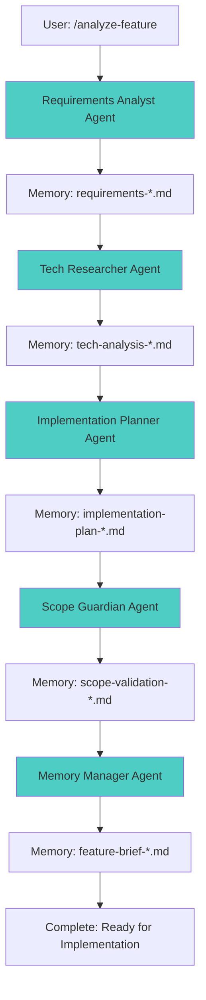

# Feature Analysis Workflow

**Version**: 1.0.0
**Status**: Production Ready
**Project Agnostic**: Works with any codebase

A complete, project-agnostic workflow for analyzing features using modern prompt engineering techniques. This workflow orchestrates specialized AI agents through the entire SDLC—from requirements gathering to implementation planning—while preventing hallucinations, scope creep, and over-engineering.

## 🎯 Overview

### What This Workflow Does

Transforms a feature idea into a comprehensive, implementation-ready plan by:

1. **Gathering Requirements** through structured, iterative questioning
2. **Researching Technologies** with grounded, comparative analysis
3. **Planning Implementation** with detailed task breakdowns and dependencies
4. **Validating Scope** to prevent feature creep and maintain MVP focus
5. **Synthesizing Knowledge** into actionable documentation

### Why Use This Workflow

- ✅ **Prevents Hallucinations**: Grounded recommendations with citations
- ✅ **Stops Feature Creep**: Ruthless scope validation at every phase
- ✅ **Ensures Completeness**: Structured methodology covers all aspects
- ✅ **Maintains Context**: Persistent memory artifacts across sessions
- ✅ **Project Agnostic**: Works with any tech stack or domain
- ✅ **Modern Techniques**: Implements Chain-of-Thought, CoVe, Step-Back prompting

## 📋 Prerequisites

### Required

- Claude Code CLI with access to Task tool
- The `code-tools` CLI (included in this project at `/tools`)

### Installation

1. Install code-tools:
   ```bash
   cd tools && pip install -e .[web]
   ```

2. Verify installation:
   ```bash
   code-tools --help
   ```

## 🚀 Quick Start

### Basic Usage

Analyze a complete feature:

```bash
/analyze-feature "Add real-time chat functionality to the application"
```

The workflow will:
1. Launch requirements analyst → gather comprehensive requirements
2. Launch tech researcher → research and recommend stack
3. Launch implementation planner → create task breakdown
4. Launch scope guardian → validate no scope creep
5. Launch memory manager → synthesize final brief

**Output**: Complete feature analysis with all artifacts stored in `.claude/memory/`

### Individual Commands

Run specific phases independently:

```bash
# Only gather requirements
/gather-requirements "Add payment processing"

# Only research technologies (requires existing requirements)
/research-tech "payment-processing"

# Only plan implementation (requires requirements + tech analysis)
/plan-implementation "payment-processing"

# Only validate scope (requires all artifacts)
/validate-scope "payment-processing"
```

## 🏗️ Architecture

### Directory Structure

```
.claude/
├── commands/              # Slash commands (user interface)
│   ├── analyze-feature.md
│   ├── gather-requirements.md
│   ├── research-tech.md
│   ├── plan-implementation.md
│   └── validate-scope.md
│
├── agents/                # Specialized agent prompts
│   ├── requirements-analyst.md
│   ├── tech-researcher.md
│   ├── implementation-planner.md
│   ├── scope-guardian.md
│   └── memory-manager.md
│
└── memory/                # Persistent knowledge storage
    ├── requirements-*.md
    ├── tech-analysis-*.md
    ├── implementation-plan-*.md
    ├── scope-validation-*.md
    └── feature-brief-*.md
```

### Workflow Execution Flow



## 🤖 Agents

### Requirements Analyst

**Specialization**: Requirements elicitation and specification
**Methodology**: 5-level questioning framework with Chain-of-Verification

**Key Techniques**:
- Iterative questioning to uncover hidden requirements
- XML-structured output for clarity
- Explicit assumption flagging
- Testable acceptance criteria

**Output**: `requirements-{feature}.md`

---

### Tech Researcher

**Specialization**: Technology stack research and recommendation
**Methodology**: Step-Back prompting → Research → Comparative analysis

**Key Techniques**:
- "According to..." prompting (source grounding)
- Comparative matrices for objective evaluation
- Hallucination prevention through citation
- Balanced pros/cons analysis

**Output**: `tech-analysis-{feature}.md`

---

### Implementation Planner

**Specialization**: Work breakdown and task planning
**Methodology**: Chain-of-Thought decomposition → Dependency mapping → Phasing

**Key Techniques**:
- Granular task breakdown (2-8 hour tasks)
- Critical path identification
- Mermaid dependency graphs
- Risk assessment and mitigation

**Output**: `implementation-plan-{feature}.md`

---

### Scope Guardian

**Specialization**: Feature creep prevention and MVP validation
**Methodology**: Scope baseline → Creep detection → MoSCoW prioritization

**Key Techniques**:
- MoSCoW method (Must/Should/Could/Won't have)
- Over-engineering detection
- MVP litmus testing
- Alignment matrices

**Output**: `scope-validation-{feature}.md`

---

### Memory Manager

**Specialization**: Knowledge synthesis and context management
**Methodology**: Artifact collection → Synthesis → Organization

**Key Techniques**:
- Multi-artifact synthesis
- Implementation checklists
- Semantic search optimization
- Version control

**Output**: `feature-brief-{feature}.md`, `checklist-{feature}.md`

## 🧠 Prompt Engineering Techniques

This workflow implements state-of-the-art prompt engineering methods:

### 1. Chain-of-Thought (CoT)
Agents reason through problems step-by-step before providing answers.

**Example** (Implementation Planner):
```
<implementation_reasoning>
Major Components: Database → API → UI
Order Rationale: Start with data model because everything depends on it
Critical Path: Schema → Models → Endpoints → Integration
</implementation_reasoning>
```

### 2. Chain-of-Verification (CoVe)
Agents verify their own outputs by asking validation questions.

**Example** (Requirements Analyst):
```
<verification>
1. Have I identified all stakeholders? → Yes: Product, Dev, Security
2. Are all workflows fully described? → Validated against user stories
3. Any ambiguous terms needing definition? → "Real-time" clarified as <500ms
</verification>
```

### 3. Step-Back Prompting
Agents first answer at a higher abstraction level before specifics.

**Example** (Tech Researcher):
```
<step_back_analysis>
Architectural Pattern: Event-driven (because real-time requirements)
Key Challenge: State synchronization across clients
Industry Standard: WebSocket with Redis pub/sub (according to Socket.io docs)
</step_back_analysis>
```

### 4. "According to..." Prompting
All factual claims are grounded in sources to prevent hallucinations.

**Example**:
- ✅ "According to the React documentation (react.dev), concurrent features enable..."
- ❌ "React is the best framework" (unsourced opinion)

### 5. XML Structure
Complex information is organized using XML-like tags for clarity.

**Example**:
```xml
<technology_option>
  <name>PostgreSQL</name>
  <strengths>
    <strength source="postgresql.org/docs">ACID compliance for transactional data</strength>
  </strengths>
</technology_option>
```

### 6. Role Prompting
Agents adopt expert personas to focus their outputs.

**Example**:
> "You are a senior business analyst with 15+ years of experience in software requirements engineering..."

## 📚 Usage Examples

### Example 1: Complete Feature Analysis

```bash
/analyze-feature "Add real-time collaborative editing to documents"
```

**What Happens**:
1. Requirements Analyst asks 15-20 structured questions about:
   - Who will collaborate? (users, roles)
   - What operations? (simultaneous edits, conflict resolution)
   - Performance expectations? (latency < 200ms)
   - Security? (access control, audit logs)

2. Tech Researcher evaluates options:
   - Operational Transformation vs CRDT algorithms
   - WebSocket vs Server-Sent Events vs HTTP polling
   - Compares ShareDB vs Yjs vs Automerge
   - Provides grounded recommendations with citations

3. Implementation Planner creates:
   - 30-40 granular tasks across 4 phases
   - Dependency graph showing critical path
   - Risk assessment (network latency, concurrent edits)
   - Timeline estimate: 6-8 weeks

4. Scope Guardian validates:
   - Flags "collaborative video chat" as scope creep → defer to Phase 2
   - Confirms MVP: text editing only (not spreadsheets/diagrams)
   - Validates all tasks map to requirements

5. Memory Manager synthesizes:
   - Executive summary for stakeholders
   - Technical brief for developers
   - Implementation checklist with acceptance criteria

**Output Files**:
- `requirements-collaborative-editing.md` (8 functional, 6 non-functional requirements)
- `tech-analysis-collaborative-editing.md` (Recommends: CRDT with Yjs + WebSocket)
- `implementation-plan-collaborative-editing.md` (38 tasks, 4 phases, 6-8 weeks)
- `scope-validation-collaborative-editing.md` (3 items deferred, MVP validated)
- `feature-brief-collaborative-editing.md` (Ready for development)

---

### Example 2: Requirements Only

```bash
/gather-requirements "Add OAuth2 social login (Google, GitHub)"
```

**What Happens**:
- Requirements Analyst asks questions about:
  - Which social providers? (Google, GitHub initially)
  - Account linking strategy? (link to existing or create new)
  - Data permissions needed? (email, profile only)
  - Fallback handling? (if OAuth unavailable)
- Creates structured requirements document
- Stores at `.claude/memory/requirements-oauth-social-login.md`

**Use Case**: When you want to explore requirements before committing to full analysis.

---

### Example 3: Technology Research Only

```bash
# First create requirements (or use existing)
/gather-requirements "Add caching layer for API responses"

# Then research technologies
/research-tech "api-caching"
```

**What Happens**:
- Tech Researcher loads requirements from memory
- Researches caching solutions: Redis, Memcached, Cloudflare Workers KV
- Compares based on: speed, TTL features, distributed support, cost
- Provides recommendation: Redis (with justification from redis.io docs)
- Stores at `.claude/memory/tech-analysis-api-caching.md`

**Use Case**: When requirements are clear but tech stack is uncertain.

---

### Example 4: Scope Validation Only

```bash
# After completing requirements, tech, and planning
/validate-scope "user-notifications"
```

**What Happens**:
- Scope Guardian loads all artifacts
- Validates each requirement, tech choice, and task against original user request
- Flags: "Push notifications to mobile devices" as scope creep (not in original request)
- Recommends: Defer to Phase 2
- Redefines MVP: Email notifications only
- Stores validation at `.claude/memory/scope-validation-user-notifications.md`

**Use Case**: When you suspect scope has expanded and need validation.

## 🔧 Integration with code-tools

All agents leverage the `code-tools` CLI for:

### Context Gathering
```bash
# Understand existing codebase
code-tools list_dir --path src --depth 2
code-tools search_file --glob "**/*.{js,py,java}" --limit 20
code-tools grep_code --pattern "class |function |def " --limit 50
```

### Memory Retrieval
```bash
# Search for relevant past decisions
code-tools search_memory --dir .claude/memory --query "authentication security" --topk 5
```

### Artifact Storage
```bash
# Create memory artifacts
code-tools create_file --file .claude/memory/requirements-{feature}.md --content @reqs.txt
```

### External Research
```bash
# Fetch documentation for grounding
code-tools fetch_content --url https://react.dev/reference/react
```

## 🎯 Best Practices

### For Users

1. **Be Specific in Feature Descriptions**
   - ✅ "Add real-time chat with typing indicators, message history, and user presence"
   - ❌ "Add chat"

2. **Trust the Process**
   - Let agents ask questions before jumping to solutions
   - Answer thoroughly during requirements phase (saves rework)

3. **Review and Validate**
   - Always review scope validation output
   - Challenge assumptions flagged by agents
   - Confirm scope boundaries are correct

4. **Iterate When Needed**
   - Requirements unclear? Re-run `/gather-requirements`
   - Scope crept? Re-run `/validate-scope`

### For Customization

1. **Adjust Agent Prompts**
   - Edit files in `.claude/agents/` to match your team's processes
   - Add domain-specific requirements (e.g., HIPAA for healthcare)

2. **Add Project-Specific Context**
   - Create `.claude/memory/project-context.md` with:
     - Tech stack conventions
     - Architectural patterns
     - Coding standards
   - Agents will retrieve this automatically

3. **Extend with New Agents**
   - Create `.claude/agents/security-reviewer.md` for security-focused analysis
   - Create `.claude/agents/cost-estimator.md` for cloud cost projections

## 🛡️ Hallucination Prevention

This workflow employs multiple strategies to prevent AI hallucinations:

| Strategy | Implementation | Effect |
|----------|----------------|--------|
| **Source Grounding** | "According to..." prompting | Forces citation of sources |
| **Context Injection** | Feed requirements to all downstream agents | Reduces invented details |
| **Chain-of-Verification** | Agents verify their own outputs | Catches inconsistencies |
| **Explicit Assumptions** | Flag inferred information as "ASSUMPTION:" | Makes guesses visible |
| **Comparative Analysis** | Require multiple options with pros/cons | Prevents bias toward one solution |
| **Memory Cross-Reference** | Validate against stored artifacts | Ensures consistency |
| **Scope Validation** | Separate agent validates alignment | Catches scope creep/hallucinations |

## 📊 Output Artifacts

### 1. Requirements Document
**File**: `requirements-{feature}.md`

**Contains**:
- Executive summary
- Functional requirements (with acceptance criteria)
- Non-functional requirements (performance, security, etc.)
- Constraints and dependencies
- Explicitly out-of-scope items
- Success criteria

**Uses**: Input for all downstream phases

---

### 2. Technology Analysis
**File**: `tech-analysis-{feature}.md`

**Contains**:
- Step-back architectural analysis
- 2-3 evaluated options per technology category
- Comparative matrices
- Grounded recommendations with citations
- Risk assessment
- Best practices

**Uses**: Technology selection, architectural decisions

---

### 3. Implementation Plan
**File**: `implementation-plan-{feature}.md`

**Contains**:
- Work breakdown structure (30-50 tasks)
- Dependency graph (Mermaid diagram)
- Critical path analysis
- Phased delivery plan
- Resource requirements
- Risk register
- Quality assurance plan
- Timeline and milestones

**Uses**: Sprint planning, task assignment, progress tracking

---

### 4. Scope Validation
**File**: `scope-validation-{feature}.md`

**Contains**:
- Core scope baseline
- Scope creep analysis (per artifact)
- MVP definition (MoSCoW prioritization)
- Alignment matrix
- Keep/Defer/Remove recommendations

**Uses**: Scope control, MVP definition, Phase 2 planning

---

### 5. Feature Brief
**File**: `feature-brief-{feature}.md`

**Contains**:
- Executive summary (what/why/how/when)
- Requirements summary
- Technology decisions
- Implementation approach
- Scope boundaries
- Risks and mitigations
- Next steps

**Uses**: Stakeholder communication, implementation kickoff

---

### 6. Implementation Checklist
**File**: `checklist-{feature}.md`

**Contains**:
- Pre-development setup
- Phase-by-phase task checklist
- Exit criteria per phase
- Definition of done
- Quick reference

**Uses**: Developer onboarding, progress tracking

## 🔄 Workflow Lifecycle

```
Idea → Requirements → Tech Research → Planning → Validation → Implementation → Completion

     ↓              ↓                ↓            ↓              ↓                ↓
  Feature      Requirements      Tech         Impl Plan    Scope         Feature Brief
  Concept         .md          Analysis .md      .md      Validation .md   + Checklist

                                                 ↓
                                         [Start Development]
                                                 ↓
                                         Use checklist
                                         Mark tasks complete
                                         Iterate as needed
                                                 ↓
                                         [Feature Complete]
                                                 ↓
                                         Archive to
                                         .claude/memory/archive/
```

## 🚨 Troubleshooting

### Issue: Agent not finding existing artifacts

**Symptom**: Tech Researcher says "requirements not found"

**Solution**:
```bash
# Check if file exists
ls .claude/memory/requirements-*.md

# If exists, verify file name matches
code-tools search_file --glob ".claude/memory/requirements-*" --limit 10
```

---

### Issue: Scope validation flags too many items as creep

**Symptom**: Scope Guardian defers most features to Phase 2

**Solution**:
- Review original requirements for clarity
- May indicate requirements were vague
- Re-run `/gather-requirements` with more specificity

---

### Issue: Implementation plan tasks are too large

**Symptom**: Tasks estimated at 20+ hours

**Solution**:
- Edit `.claude/agents/implementation-planner.md`
- Adjust task granularity guidance
- Re-run `/plan-implementation`

---

### Issue: Tech recommendations feel biased

**Symptom**: Always recommends trendy technologies

**Solution**:
- Review `.claude/agents/tech-researcher.md`
- Ensure "According to..." prompting is enforced
- Add constraint: "Prioritize proven, stable technologies"

## 📖 References

This workflow implements techniques from:

- **Prompt Engineering Research**:
  - Chain-of-Thought (Wei et al., 2022)
  - Chain-of-Verification (Dhuliawala et al., 2023)
  - Step-Back Prompting (Zheng et al., 2023)

- **Industry Best Practices**:
  - SUSE AI Hallucination Prevention Guide (2025)
  - OpenAI GPT-5 Prompting Guide (2025)
  - Anthropic Claude 4.5 Documentation (2025)

- **Software Engineering**:
  - Agile Software Development (Beck et al.)
  - MoSCoW Prioritization (Clegg & Barker)
  - Work Breakdown Structures (PMI PMBOK)

## 🤝 Contributing

To extend or customize this workflow:

1. **Add New Agents**: Create `.claude/agents/{new-agent}.md`
2. **Add New Commands**: Create `.claude/commands/{new-command}.md`
3. **Improve Prompts**: Edit existing agent files with better techniques
4. **Share Templates**: Add example artifacts to `.claude/memory/EXAMPLE-*.md`

## 📄 License

This workflow is designed to be project-agnostic and freely customizable for any use case.

---

**Built with modern prompt engineering techniques for Claude Code**
**Version**: 1.0.0 | **Last Updated**: 2025-01-23
