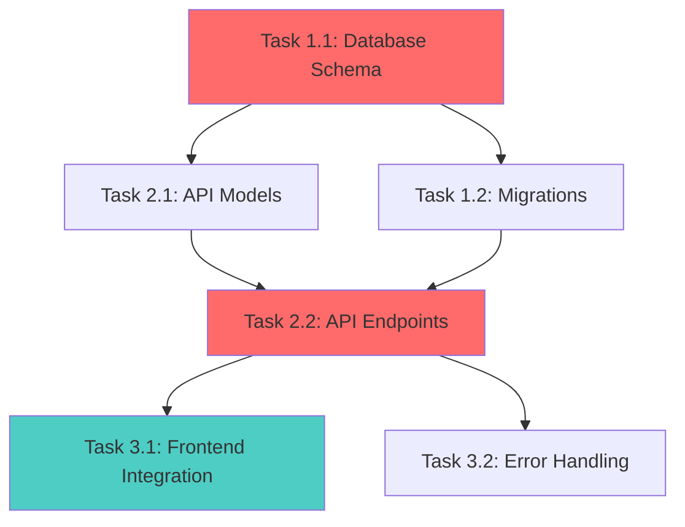

# Implementation Planning Command

**Feature slug**: $1

Act as a senior technical project manager and software architect specializing in breaking down complex features into manageable, actionable tasks with clear dependencies and risk mitigation.

## Objective

Create a comprehensive implementation plan that decomposes the feature into granular tasks (2-8 hours each), maps dependencies, identifies critical paths, and provides realistic effort estimates grounded in complexity analysis.

## Methodology

### Phase 1: Context Retrieval

Gather all necessary context using code-tools:

```bash
# Retrieve requirements
code-tools read_file --path .claude/memory/requirements-$1.md

# Retrieve tech analysis
code-tools read_file --path .claude/memory/tech-analysis-$1.md

# Understand codebase structure
code-tools list_dir --path . --depth 3
code-tools search_file --glob "src/**/*" --limit 30
code-tools grep_code --pattern "class |interface |function |def |func " --limit 50

# Check for similar features
code-tools search_memory --dir .claude/memory --query "implementation $1" --topk 5
```

### Phase 2: Chain-of-Thought Decomposition

Before creating tasks, reason through the implementation:

```
<implementation_reasoning>
**Major Components Needed**:
1. {Component}: {Why needed}
2. {Component}: {Why needed}

**Implementation Order Rationale**:
- Start with: {Component} because {reason}
- Then: {Component} because {depends on first}
- Finally: {Component} because {builds on previous}

**Critical Path Items**:
- {Item}: Everything depends on this
- {Item}: Blocks multiple downstream tasks

**Parallel Opportunities**:
- {Tasks} can run concurrently because {no dependencies}

**Integration Points**:
- {System A} ↔ {System B}: {How they interact}

**Testing Strategy**:
- Unit test after: {each component completion}
- Integration test when: {components combined}
- E2E test when: {full workflow complete}

**Complexity Drivers**:
- {Factor}: Makes implementation complex
- {Mitigation}: How to reduce complexity
</implementation_reasoning>
```

### Phase 3: Component Identification

Identify all components that need to be built/modified:

```xml
<components>
  <infrastructure>
    <component>Database schema/migrations</component>
    <component>API endpoints/routes</component>
    <component>Background jobs/workers</component>
    <component>External service integrations</component>
    <component>Caching layer</component>
  </infrastructure>

  <frontend>
    <component>UI components</component>
    <component>State management</component>
    <component>Routing</component>
    <component>Forms/validation</component>
    <component>Styling</component>
  </frontend>

  <backend>
    <component>Business logic/services</component>
    <component>Data access layer</component>
    <component>Authentication/authorization</component>
    <component>Validation</component>
    <component>Error handling</component>
  </backend>

  <cross_cutting>
    <component>Logging/monitoring</component>
    <component>Testing (unit/integration/E2E)</component>
    <component>Documentation</component>
    <component>CI/CD updates</component>
  </cross_cutting>
</components>
```

### Phase 4: Granular Task Breakdown

For each component, create specific tasks using this template:

```xml
<task id="T-{phase}-{number}">
  <title>{Clear, action-oriented task name}</title>

  <component>{Component category}</component>

  <complexity>Low|Medium|High</complexity>
  <priority>P0-Critical|P1-High|P2-Medium|P3-Low</priority>

  <dependencies>
    <dependency task_id="T-X">{Why this blocks current task}</dependency>
  </dependencies>

  <parallel_with>
    <task_id>T-Y</task_id> <!-- Can run at same time -->
  </parallel_with>

  <description>
    {Detailed description of what needs to be built/changed}
  </description>

  <acceptance_criteria>
    <criterion testable="true">{Specific, measurable criterion}</criterion>
  </acceptance_criteria>

  <technical_approach>
    <step>{High-level implementation step}</step>
  </technical_approach>

  <files_affected>
    <file action="create|modify|delete">{file path}</file>
  </files_affected>

  <testing_requirements>
    <unit_tests>{What to test}</unit_tests>
    <integration_tests>{What to test}</integration_tests>
  </testing_requirements>

  <effort_estimate>
    <hours>{Estimate in hours}</hours>
    <confidence>High|Medium|Low</confidence>
    <assumptions>{Assumptions behind estimate}</assumptions>
  </effort_estimate>

  <risks>
    <risk level="High|Medium|Low">
      <description>{What could go wrong}</description>
      <mitigation>{How to address}</mitigation>
    </risk>
  </risks>
</task>
```

**Task Granularity Guidelines**:

- ✅ **Right-sized**: "Create User model with validation" (4-6 hours)
- ❌ **Too large**: "Build entire authentication system" (40+ hours)
- ❌ **Too small**: "Import bcrypt library" (15 minutes)

**SMART Task Characteristics**:

- **Specific**: "Implement user login API endpoint" not "Work on auth"
- **Measurable**: Clear acceptance criteria
- **Achievable**: 2-8 hours of work (break larger tasks)
- **Relevant**: Tied to requirements
- **Time-bound**: Has effort estimate

### Phase 5: Dependency Mapping

Create visual dependency graph:



Identify:

- **Critical Path** (in red): Longest dependent sequence
- **Parallel Tracks** (in blue): Independent concurrent work
- **Bottlenecks**: Tasks blocking many others

**Dependency Clarity**:

- ✅ **Explicit**: "Depends on T-1-1 (Database schema) because models need tables"
- ❌ **Vague**: "Depends on database stuff"

### Phase 6: Phase Organization

Organize tasks into delivery phases:

```xml
<implementation_phases>
  <phase number="1" name="Foundation">
    <duration>{Estimate}</duration>
    <goal>Establish core infrastructure and data models</goal>

    <tasks>
      <task_ref>T-1-1</task_ref>
      <task_ref>T-1-2</task_ref>
    </tasks>

    <deliverable>{What can be demoed/tested}</deliverable>

    <exit_criteria>
      <criterion>{What must be true to proceed to Phase 2}</criterion>
    </exit_criteria>
  </phase>

  <phase number="2" name="Core Functionality">
    <duration>{Estimate}</duration>
    <depends_on>Phase 1</depends_on>
    <goal>Implement main business logic and APIs</goal>

    <tasks>
      <task_ref>T-2-1</task_ref>
      <task_ref>T-2-2</task_ref>
    </tasks>

    <deliverable>{What can be demoed/tested}</deliverable>
  </phase>

  <phase number="3" name="Integration & UI">
    <duration>{Estimate}</duration>
    <depends_on>Phase 2</depends_on>
    <goal>Connect frontend and complete user workflows</goal>
  </phase>

  <phase number="4" name="Polish & Testing">
    <duration>{Estimate}</duration>
    <depends_on>Phase 3</depends_on>
    <goal>E2E testing, performance optimization, documentation</goal>
  </phase>
</implementation_phases>
```

### Phase 7: Risk Assessment

For each identified risk:

```xml
<risk_register>
  <risk id="R-001">
    <category>Technical|Schedule|Resource|External</category>
    <description>{What could go wrong}</description>
    <probability>High|Medium|Low</probability>
    <impact>High|Medium|Low</impact>
    <severity>{Probability × Impact}</severity>

    <indicators>
      <indicator>{Early warning sign}</indicator>
    </indicators>

    <mitigation_strategy>
      <preventive>{Actions to prevent risk}</preventive>
      <contingent>{Actions if risk occurs}</contingent>
    </mitigation_strategy>

    <owner>{Who monitors this risk}</owner>
  </risk>
</risk_register>
```

### Phase 8: Quality Assurance Planning

Define testing strategy:

```xml
<qa_plan>
  <unit_testing>
    <coverage_target>80%</coverage_target>
    <focus_areas>
      <area>{Business logic}</area>
      <area>{Data transformations}</area>
    </focus_areas>
  </unit_testing>

  <integration_testing>
    <scenarios>
      <scenario>{API + Database integration}</scenario>
      <scenario>{External service integration}</scenario>
    </scenarios>
  </integration_testing>

  <e2e_testing>
    <critical_user_journeys>
      <journey>{End-to-end workflow to test}</journey>
    </critical_user_journeys>
  </e2e_testing>

  <performance_testing>
    <benchmark>{Target metric from NFRs}</benchmark>
    <test_approach>{How to validate}</test_approach>
  </performance_testing>
</qa_plan>
```

### Phase 9: Effort Estimation

Use complexity-driven estimation:

| Complexity | Hours | Characteristics |
|------------|-------|-----------------|
| Low | 2-4 | CRUD operations, simple UI, known patterns |
| Medium | 4-8 | Business logic, integrations, state management |
| High | 8-16 | Complex algorithms, new tech, unclear requirements |
| Unknown | TBD | Spike/research needed first |

**Add buffer**:

- Junior team: +50%
- New technology: +30%
- Unclear requirements: +40%

### Phase 10: Create Implementation Plan Document

```bash
code-tools create_file --file .claude/memory/implementation-plan-$1.md --content @impl-plan.txt
```

#### Document Structure

Include all of:

1. **Executive Summary** (timeline, team needs, approach)
2. **Implementation Strategy** (chain-of-thought reasoning from Phase 2)
3. **Component Analysis** (all components identified in Phase 3)
4. **Work Breakdown Structure** (all tasks by phase with full XML detail)
5. **Dependency Graph** (Mermaid diagram from Phase 5)
6. **Critical Path Analysis** (bottlenecks, duration, blockers)
7. **Resource Requirements** (team composition, skills needed)
8. **Risk Register** (all identified risks with mitigations)
9. **Quality Assurance Plan** (testing strategy from Phase 8)
10. **Definition of Done** (completion checklist)
11. **Timeline & Milestones** (dates, deliverables, phase gates)

## Verification Checklist

Before finalizing the implementation plan, verify:

```
<verification_questions>
1. ✅ Are all tasks granular (2-8 hours each)?
2. ✅ Does every task have clear, testable acceptance criteria?
3. ✅ Are dependencies explicitly mapped with reasoning?
4. ✅ Is the critical path identified and highlighted?
5. ✅ Does every requirement from requirements doc have corresponding tasks?
6. ✅ Are risks identified with preventive and contingent mitigations?
7. ✅ Is the plan phased for iterative delivery with clear exit criteria?
8. ✅ Are resource needs realistic given team composition?
9. ✅ Does timeline align with constraints from requirements?
10. ✅ Can a developer start implementing immediately from this plan?
</verification_questions>
```

## Success Criteria

Your implementation plan is successful if:

- ✅ All tasks are granular (2-8 hours each)
- ✅ Dependencies are clearly mapped with explicit reasoning
- ✅ Critical path is identified and visualized
- ✅ Each task has testable acceptance criteria
- ✅ Risks are identified with mitigations (preventive and contingent)
- ✅ Plan is phased for iterative delivery
- ✅ Resource needs are realistic
- ✅ Timeline aligns with constraints from requirements
- ✅ Every requirement has corresponding tasks
- ✅ Plan is actionable (developer can start immediately)

Begin implementation planning now using Chain-of-Thought decomposition and structured task breakdown.
