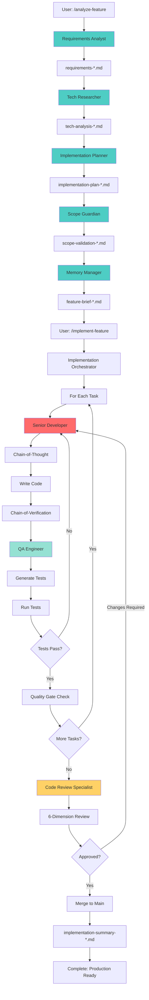

# Complete SDLC Workflow with Advanced Prompt Engineering

**Version**: 2.1.0
**Status**: Production Ready (Phase 2 Orchestration Complete)
**Project Agnostic**: Works with any codebase

A complete, end-to-end SDLC workflow that takes features from idea to production-ready code using advanced prompt engineering techniques. This workflow orchestrates specialized AI agents through the entire software development lifecycle—from requirements gathering through actual implementation—while preventing hallucinations, scope creep, and over-engineering.

## 🎯 Overview

### What This Workflow Does

Transforms a feature idea into **working, tested, production-ready code** by:

1. **🆕 Generating Memory** from existing codebases (for brownfield projects)
2. **Gathering Requirements** through structured, iterative questioning (5-level framework + CoVe)
3. **Researching Technologies** with grounded, comparative analysis (Step-Back + "According to...")
4. **Planning Implementation** with detailed task breakdowns and dependencies (CoT + dependency graphs)
5. **Validating Scope** to prevent feature creep and maintain MVP focus (MoSCoW prioritization)
6. **🆕 Designing UX/UI** with wireframes, user flows, and accessibility specifications
7. **Implementing Features** with quality gates and anti-hallucination measures
8. **🆕 Reviewing Code** with systematic peer review before merge
9. **Testing & Validation** with comprehensive test coverage
10. **Synthesizing Knowledge** into actionable documentation

### Why Use This Workflow

- ✅ **Prevents Hallucinations**: Grounded recommendations with citations
- ✅ **Stops Feature Creep**: Ruthless scope validation at every phase
- ✅ **Ensures Completeness**: Structured methodology covers all aspects
- ✅ **Maintains Context**: Persistent memory artifacts across sessions
- ✅ **Project Agnostic**: Works with any tech stack or domain
- ✅ **Modern Techniques**: Implements Chain-of-Thought, CoVe, Step-Back prompting

## 📋 Prerequisites

### Required

- Claude Code CLI with access to Task tool
- The `code-tools` CLI (included in this project at `/tools`)

### Installation

1. Install code-tools:

   ```bash
   cd tools && pip install -e .[web]
   ```

2. Verify installation:

   ```bash
   code-tools --help
   ```

## 🚀 Quick Start

### For Existing Codebases (Brownfield)

**Step 1: Generate memory baseline** (one-time setup per codebase):

```bash
/generate-memory
```

This analyzes your existing codebase and creates 5 memory artifacts:
- `project-context.md` - High-level overview
- `tech-stack-baseline.md` - Current technologies with rationale
- `coding-conventions.md` - Patterns agents should follow
- `architecture-decisions.md` - Inferred ADRs
- `feature-inventory.md` - Existing features catalog

**Step 2: Add new features** (agents now have context):

```bash
/analyze-feature "Add real-time chat functionality"
```

Agents will automatically reference existing conventions and architecture.

---

### For New Projects (Greenfield)

Analyze a complete feature:

```bash
/analyze-feature "Add real-time chat functionality to the application"
```

The workflow will:

1. Launch requirements analyst → gather comprehensive requirements
2. Launch tech researcher → research and recommend stack
3. Launch implementation planner → create task breakdown
4. Launch scope guardian → validate no scope creep
5. Launch memory manager → synthesize final brief

**Output**: Complete feature analysis with all artifacts stored in `.claude/memory/`

### Individual Commands

Run specific phases independently. Commands are organized in subfolders by SDLC phase but called without path prefix:

```bash
# Workflow Commands (workflow/) - End-to-end orchestrators
/analyze-feature "Add payment processing"     # Complete planning workflow → 5 agents
/implement-feature "payment-processing"       # Complete implementation → developer + QA

# Memory Commands (memory/) - Artifact management for existing codebases
/generate-memory                              # Deep codebase analysis → 5 baseline artifacts
/update-memory "tech-stack"                   # Incremental update after changes
/cleanup-memory "payment-processing"          # Remove feature artifacts

# Requirements Commands (requirements/) - Requirements gathering
/gather-requirements "Add payment processing" # → requirements-analyst agent

# Research Commands (research/) - Technology & pattern research
/research-tech "payment-processing"           # → tech-researcher agent
/mine-patterns --type "error-handling"        # Extract patterns (8 types available)

# Planning Commands (planning/) - Implementation planning
/plan-implementation "payment-processing"     # → implementation-planner agent

# Design Commands (design/) - UI/UX design
/design-ui "payment-processing"               # → ux-ui-designer agent

# Task Commands (tasks/) - Task lifecycle management
/task-status "payment-processing"             # Check feature progress
/task-next "payment-processing"               # Get next available task
/task-start "payment-processing" "T01"        # Start a specific task
/task-complete "payment-processing" "T01"     # Complete a task
/task-block "payment-processing" "T01"        # Block a task with reason
/task-unblock "payment-processing" "T01"      # Unblock a task

# Quality Commands (quality/) - Validation & review
/validate-scope "payment-processing"          # → scope-guardian agent
/validate-consistency "payment-processing"    # Check against conventions
/validate-manifests                           # Check manifest sync
/review-code "payment-processing"             # → code-review-specialist
```

### Complete Workflow (Planning + Implementation)

```bash
# Step 1: Plan the feature (analysis workflow)
/analyze-feature "Add payment processing with Stripe"

# Step 2: Implement the planned feature (NEW)
/implement-feature "payment-processing"
```

This takes you from idea → production-ready code.

## 🏗️ Architecture

### Directory Structure

Commands are now organized by SDLC phase for easier navigation:

```
.claude/
├── commands/              # Slash commands organized by phase
│   ├── workflow/          # End-to-end orchestrators
│   │   ├── analyze-feature.md      # Complete planning workflow
│   │   └── implement-feature.md    # Complete implementation workflow
│   │
│   ├── requirements/      # Requirements gathering phase
│   │   └── gather-requirements.md  # → requirements-analyst agent
│   │
│   ├── research/          # Technology & pattern research
│   │   ├── research-tech.md        # → tech-researcher agent
│   │   └── mine-patterns.md        # Pattern extraction (8 types)
│   │
│   ├── planning/          # Implementation planning
│   │   └── plan-implementation.md  # → implementation-planner agent
│   │
│   ├── design/            # UI/UX design
│   │   └── design-ui.md            # → ux-ui-designer agent
│   │
│   ├── tasks/             # Task lifecycle management
│   │   ├── task-start.md           # Start a task
│   │   ├── task-complete.md        # Complete a task
│   │   ├── task-next.md            # Find next task
│   │   ├── task-status.md          # Check progress
│   │   ├── task-block.md           # Block a task
│   │   └── task-unblock.md         # Unblock a task
│   │
│   ├── quality/           # Validation & review
│   │   ├── review-code.md          # → code-review-specialist
│   │   ├── validate-manifests.md   # Manifest consistency
│   │   ├── validate-scope.md       # → scope-guardian agent
│   │   └── validate-consistency.md # Convention validation
│   │
│   └── memory/            # Artifact management
│       ├── generate-memory.md      # → codebase-archeologist
│       ├── update-memory.md        # Incremental updates
│       └── cleanup-memory.md       # Artifact cleanup
│
├── agents/                # Specialized agent prompts
│   ├── requirements-analyst.md     # Requirements elicitation
│   ├── tech-researcher.md          # Technology research
│   ├── implementation-planner.md   # Work breakdown
│   ├── scope-guardian.md           # Scope protection
│   ├── memory-manager.md           # Knowledge synthesis
│   ├── ux-ui-designer.md           # 🆕 UX/UI design specialist
│   ├── senior-developer.md         # Code implementation
│   ├── code-review-specialist.md   # 🆕 Peer code review
│   └── qa-engineer.md              # Testing & validation
│
└── memory/                # Persistent knowledge storage
    ├── requirements-*.md
    ├── tech-analysis-*.md
    ├── implementation-plan-*.md
    ├── scope-validation-*.md
    ├── design-spec-*.md            # 🆕 Design specifications
    ├── feature-brief-*.md
    ├── implementation-*.md         # Implementation logs
    ├── code-review-*.md            # 🆕 Code review reports
    ├── test-results-*.md           # Test reports
    └── implementation-summary-*.md # Final summary
```

### Workflow Execution Flow



## 🤖 Agents

### Requirements Analyst

**Specialization**: Requirements elicitation and specification
**Methodology**: 5-level questioning framework with Chain-of-Verification

**Key Techniques**:

- Iterative questioning to uncover hidden requirements
- XML-structured output for clarity
- Explicit assumption flagging
- Testable acceptance criteria

**Output**: `requirements-{feature}.md`

---

### Tech Researcher

**Specialization**: Technology stack research and recommendation
**Methodology**: Step-Back prompting → Research → Comparative analysis

**Key Techniques**:

- "According to..." prompting (source grounding)
- Comparative matrices for objective evaluation
- Hallucination prevention through citation
- Balanced pros/cons analysis

**Output**: `tech-analysis-{feature}.md`

---

### Implementation Planner

**Specialization**: Work breakdown and task planning
**Methodology**: Chain-of-Thought decomposition → Dependency mapping → Phasing

**Key Techniques**:

- Granular task breakdown (2-8 hour tasks)
- Critical path identification
- Mermaid dependency graphs
- Risk assessment and mitigation

**Output**: `implementation-plan-{feature}.md`

---

### Scope Guardian

**Specialization**: Feature creep prevention and MVP validation
**Methodology**: Scope baseline → Creep detection → MoSCoW prioritization

**Key Techniques**:

- MoSCoW method (Must/Should/Could/Won't have)
- Over-engineering detection
- MVP litmus testing
- Alignment matrices

**Output**: `scope-validation-{feature}.md`

---

### Memory Manager

**Specialization**: Knowledge synthesis and context management
**Methodology**: Artifact collection → Synthesis → Organization

**Key Techniques**:

- Multi-artifact synthesis
- Implementation checklists
- Semantic search optimization
- Version control

**Output**: `feature-brief-{feature}.md`, `checklist-{feature}.md`

---

### 🆕 Senior Developer

**Specialization**: Code implementation with advanced prompt engineering
**Methodology**: CoT reasoning → Grounded implementation → CoVe verification → Testing

**Key Techniques**:

- Chain-of-Thought for implementation planning
- "According to..." API verification (prevents hallucinations)
- Step-Back prompting for complex algorithms
- Security-first coding checklist
- Multi-pass refinement (basic → edge cases → optimization → polish)

**Anti-Hallucination Measures**:

- Verifies all APIs in tech analysis or official docs
- Flags assumptions explicitly
- Cross-checks against requirements
- No invented library methods

**Output**: Production code files, implementation logs

---

### 🆕 QA Engineer

**Specialization**: Comprehensive testing and quality assurance
**Methodology**: Test strategy → Test generation → Automation → Execution → Reporting

**Key Techniques**:

- Test pyramid (unit, integration, E2E)
- Edge case identification
- Test data generation
- Performance and security testing
- Coverage analysis with gap identification

**Quality Gates**:

- 80%+ code coverage
- All tests passing
- Edge cases covered
- Security checklist complete

**Output**: Test suites, test results, coverage reports

---

### 🆕 UX/UI Designer

**Specialization**: User experience research and interface design
**Methodology**: UX research → IA → Wireframing → Visual design → Accessibility → Responsive → Handoff

**Key Techniques**:

- Step-Back prompting for foundational UX questions
- Information architecture and user flow diagrams (Mermaid)
- ASCII wireframes with detailed specifications
- Design tokens and component libraries
- WCAG 2.1 AA accessibility compliance
- Mobile-first responsive design
- Developer handoff documentation

**Output**: `design-spec-{feature}.md` with complete UI specifications

---

### 🆕 Code Review Specialist

**Specialization**: Pre-merge peer review for code quality and correctness
**Methodology**: Context gathering → Structural review → 6-dimension analysis → Line-by-line review → CoVe

**Key Techniques**:

- 6-dimension review framework (Correctness, Quality, Security, Performance, Testability, Maintainability)
- Evidence-based severity classification (Blocker/Major/Minor/Suggestion)
- "According to..." prompting for grounded best practices
- Step-Back prompting for architectural review
- Anti-hallucination validation (verify against project conventions)
- Merge decision logic with clear criteria

**Review Dimensions**:
- **Correctness** (P0): Logic errors, edge cases, concurrency issues
- **Code Quality** (P1): Clarity, simplicity, idioms, naming
- **Security** (P0): Vulnerabilities, secrets, injection attacks
- **Performance** (P2): Algorithmic complexity, N+1 queries, resource leaks
- **Testability** (P1): Test coverage, test quality, dependency injection
- **Maintainability** (P2): Documentation, API design, error messages

**Output**: `code-review-{feature}.md` with findings and merge recommendation

## 🧠 Prompt Engineering Techniques

This workflow implements state-of-the-art prompt engineering methods:

### 1. Chain-of-Thought (CoT)

Agents reason through problems step-by-step before providing answers.

**Example** (Implementation Planner):

```
<implementation_reasoning>
Major Components: Database → API → UI
Order Rationale: Start with data model because everything depends on it
Critical Path: Schema → Models → Endpoints → Integration
</implementation_reasoning>
```

### 2. Chain-of-Verification (CoVe)

Agents verify their own outputs by asking validation questions.

**Example** (Requirements Analyst):

```
<verification>
1. Have I identified all stakeholders? → Yes: Product, Dev, Security
2. Are all workflows fully described? → Validated against user stories
3. Any ambiguous terms needing definition? → "Real-time" clarified as <500ms
</verification>
```

### 3. Step-Back Prompting

Agents first answer at a higher abstraction level before specifics.

**Example** (Tech Researcher):

```
<step_back_analysis>
Architectural Pattern: Event-driven (because real-time requirements)
Key Challenge: State synchronization across clients
Industry Standard: WebSocket with Redis pub/sub (according to Socket.io docs)
</step_back_analysis>
```

### 4. "According to..." Prompting

All factual claims are grounded in sources to prevent hallucinations.

**Example**:

- ✅ "According to the React documentation (react.dev), concurrent features enable..."
- ❌ "React is the best framework" (unsourced opinion)

### 5. XML Structure

Complex information is organized using XML-like tags for clarity.

**Example**:

```xml
<technology_option>
  <name>PostgreSQL</name>
  <strengths>
    <strength source="postgresql.org/docs">ACID compliance for transactional data</strength>
  </strengths>
</technology_option>
```

### 6. Role Prompting

Agents adopt expert personas to focus their outputs.

**Example**:
> "You are a senior business analyst with 15+ years of experience in software requirements engineering..."

## 📚 Usage Examples

### Example 1: Complete End-to-End Workflow 🆕

```bash
# Step 1: Plan the feature
/analyze-feature "Add user authentication with JWT tokens"

# Step 2: Implement the feature
/implement-feature "user-authentication"
```

**Planning Phase** (`/analyze-feature`):

1. **Requirements Analyst** asks structured questions:
   - Auth methods? (email/password, social login later)
   - Token expiry? (1 hour access, 7 day refresh)
   - Password requirements? (min 8 chars, complexity rules)
   - Rate limiting? (5 failed attempts → 15 min lockout)
   - **Output**: `requirements-user-authentication.md` (7 FRs, 5 NFRs)

2. **Tech Researcher** evaluates options:
   - According to jwt.io docs: JWT for stateless auth
   - bcrypt for password hashing (OWASP recommended)
   - Redis for token blacklist
   - **Output**: `tech-analysis-user-authentication.md`

3. **Implementation Planner** breaks down work:
   - 12 tasks across 3 phases
   - T-1-1: Database schema for users
   - T-1-2: Password hashing utility
   - T-2-1: Login endpoint with JWT generation
   - T-2-2: Auth middleware for protected routes
   - T-3-1: Token refresh endpoint
   - **Output**: `implementation-plan-user-authentication.md`

4. **Scope Guardian** validates:
   - Confirms no scope creep
   - Defers "OAuth social login" to Phase 2 (not in MVP)
   - **Output**: `scope-validation-user-authentication.md`

**Implementation Phase** 🆕 (`/implement-feature`):

1. **Implementation Orchestrator** loads all planning artifacts and executes tasks in dependency order

2. **For Task T-1-1** (Database schema):
   - **Senior Developer** uses CoT:

     ```
     <reasoning>
     Need users table with: id, email, password_hash, created_at
     Password stored as hash (bcrypt), never plaintext
     Email unique constraint for login
     </reasoning>
     ```

   - Generates migration file
   - Runs CoVe verification (checks against requirements)
   - **QA Engineer** creates tests:
     - Test: Schema has required columns
     - Test: Email uniqueness enforced
     - Test: No plaintext passwords possible
   - **All tests pass** ✅

3. **For Task T-2-1** (Login endpoint):
   - **Senior Developer**:
     - Reads requirements (rate limiting: 5 attempts)
     - According to express-rate-limit docs: uses middleware
     - Implements POST /auth/login endpoint
     - Validates email/password
     - Generates JWT with 1hr expiry
     - Returns token + refresh token
   - **QA Engineer** creates tests:
     - Happy path: Valid credentials → returns tokens
     - Edge case: Invalid password → 401 error
     - Edge case: Non-existent email → 401 error
     - Edge case: 6th failed attempt → 429 (rate limited)
     - Security: SQL injection attempt → blocked
   - **All tests pass** ✅
   - **Quality Gate**: Coverage 87%, security checklist complete ✅

4. **Process continues** for all 12 tasks...

5. **Final Verification**:
   - All 12 tasks complete
   - 47 tests passing (unit + integration + E2E)
   - Code coverage: 89%
   - Security audit: No vulnerabilities
   - Performance: Login latency <150ms (requirement: <500ms)
   - **Output**: `implementation-summary-user-authentication.md`

**Complete Output Files**:

```
.claude/memory/
├── requirements-user-authentication.md        # 7 FRs, 5 NFRs
├── tech-analysis-user-authentication.md       # JWT + bcrypt + Redis
├── implementation-plan-user-authentication.md # 12 tasks, 3 phases
├── scope-validation-user-authentication.md    # OAuth deferred
├── feature-brief-user-authentication.md       # Stakeholder summary
├── implementation-T-*.md                      # 12 task logs
├── test-results-user-authentication.md        # 47 tests passing
└── implementation-summary-user-authentication.md  # READY FOR PRODUCTION
```

**Timeline**: Planning (2-3 hours) + Implementation (3-4 days with testing)
**Result**: Production-ready authentication system with comprehensive tests

---

### Example 2: Planning Only (Original Workflow)

```bash
/analyze-feature "Add real-time collaborative editing to documents"
```

**What Happens**: [Same as before - planning phase only]

**Use Case**: When you want to plan first, implement later

---

### Example 2: Requirements Only

```bash
/gather-requirements "Add OAuth2 social login (Google, GitHub)"
```

**What Happens**:

- Requirements Analyst asks questions about:
  - Which social providers? (Google, GitHub initially)
  - Account linking strategy? (link to existing or create new)
  - Data permissions needed? (email, profile only)
  - Fallback handling? (if OAuth unavailable)
- Creates structured requirements document
- Stores at `.claude/memory/requirements-oauth-social-login.md`

**Use Case**: When you want to explore requirements before committing to full analysis.

---

### Example 3: Technology Research Only

```bash
# First create requirements (or use existing)
/gather-requirements "Add caching layer for API responses"

# Then research technologies
/research-tech "api-caching"
```

**What Happens**:

- Tech Researcher loads requirements from memory
- Researches caching solutions: Redis, Memcached, Cloudflare Workers KV
- Compares based on: speed, TTL features, distributed support, cost
- Provides recommendation: Redis (with justification from redis.io docs)
- Stores at `.claude/memory/tech-analysis-api-caching.md`

**Use Case**: When requirements are clear but tech stack is uncertain.

---

### Example 4: Scope Validation Only

```bash
# After completing requirements, tech, and planning
/validate-scope "user-notifications"
```

**What Happens**:

- Scope Guardian loads all artifacts
- Validates each requirement, tech choice, and task against original user request
- Flags: "Push notifications to mobile devices" as scope creep (not in original request)
- Recommends: Defer to Phase 2
- Redefines MVP: Email notifications only
- Stores validation at `.claude/memory/scope-validation-user-notifications.md`

**Use Case**: When you suspect scope has expanded and need validation.

## 🔧 Integration with code-tools

All agents leverage the `code-tools` CLI for:

### Context Gathering

```bash
# Understand existing codebase
code-tools list_dir --path src --depth 2
code-tools search_file --glob "**/*.{js,py,java}" --limit 20
code-tools grep_code --pattern "class |function |def " --limit 50
```

### Memory Retrieval

```bash
# Search for relevant past decisions
code-tools search_memory --dir .claude/memory --query "authentication security" --topk 5
```

### Artifact Storage

```bash
# Create memory artifacts
code-tools create_file --file .claude/memory/requirements-{feature}.md --content @reqs.txt
```

### External Research

```bash
# Fetch documentation for grounding
code-tools fetch_content --url https://react.dev/reference/react
```

## 🎯 Best Practices

### For Users

1. **Be Specific in Feature Descriptions**
   - ✅ "Add real-time chat with typing indicators, message history, and user presence"
   - ❌ "Add chat"

2. **Trust the Process**
   - Let agents ask questions before jumping to solutions
   - Answer thoroughly during requirements phase (saves rework)

3. **Review and Validate**
   - Always review scope validation output
   - Challenge assumptions flagged by agents
   - Confirm scope boundaries are correct

4. **Iterate When Needed**
   - Requirements unclear? Re-run `/gather-requirements`
   - Scope crept? Re-run `/validate-scope`

### For Customization

1. **Adjust Agent Prompts**
   - Edit files in `.claude/agents/` to match your team's processes
   - Add domain-specific requirements (e.g., HIPAA for healthcare)

2. **Add Project-Specific Context**
   - Create `.claude/memory/project-context.md` with:
     - Tech stack conventions
     - Architectural patterns
     - Coding standards
   - Agents will retrieve this automatically

3. **Extend with New Agents**
   - Create `.claude/agents/security-reviewer.md` for security-focused analysis
   - Create `.claude/agents/cost-estimator.md` for cloud cost projections

## 🛡️ Hallucination Prevention

This workflow employs multiple strategies to prevent AI hallucinations:

| Strategy | Implementation | Effect |
|----------|----------------|--------|
| **Source Grounding** | "According to..." prompting | Forces citation of sources |
| **Context Injection** | Feed requirements to all downstream agents | Reduces invented details |
| **Chain-of-Verification** | Agents verify their own outputs | Catches inconsistencies |
| **Explicit Assumptions** | Flag inferred information as "ASSUMPTION:" | Makes guesses visible |
| **Comparative Analysis** | Require multiple options with pros/cons | Prevents bias toward one solution |
| **Memory Cross-Reference** | Validate against stored artifacts | Ensures consistency |
| **Scope Validation** | Separate agent validates alignment | Catches scope creep/hallucinations |

## 📊 Output Artifacts

### 1. Requirements Document

**File**: `requirements-{feature}.md`

**Contains**:

- Executive summary
- Functional requirements (with acceptance criteria)
- Non-functional requirements (performance, security, etc.)
- Constraints and dependencies
- Explicitly out-of-scope items
- Success criteria

**Uses**: Input for all downstream phases

---

### 2. Technology Analysis

**File**: `tech-analysis-{feature}.md`

**Contains**:

- Step-back architectural analysis
- 2-3 evaluated options per technology category
- Comparative matrices
- Grounded recommendations with citations
- Risk assessment
- Best practices

**Uses**: Technology selection, architectural decisions

---

### 3. Implementation Plan

**File**: `implementation-plan-{feature}.md`

**Contains**:

- Work breakdown structure (30-50 tasks)
- Dependency graph (Mermaid diagram)
- Critical path analysis
- Phased delivery plan
- Resource requirements
- Risk register
- Quality assurance plan
- Timeline and milestones

**Uses**: Sprint planning, task assignment, progress tracking

---

### 4. Scope Validation

**File**: `scope-validation-{feature}.md`

**Contains**:

- Core scope baseline
- Scope creep analysis (per artifact)
- MVP definition (MoSCoW prioritization)
- Alignment matrix
- Keep/Defer/Remove recommendations

**Uses**: Scope control, MVP definition, Phase 2 planning

---

### 5. Feature Brief

**File**: `feature-brief-{feature}.md`

**Contains**:

- Executive summary (what/why/how/when)
- Requirements summary
- Technology decisions
- Implementation approach
- Scope boundaries
- Risks and mitigations
- Next steps

**Uses**: Stakeholder communication, implementation kickoff

---

### 6. Implementation Checklist

**File**: `checklist-{feature}.md`

**Contains**:

- Pre-development setup
- Phase-by-phase task checklist
- Exit criteria per phase
- Definition of done
- Quick reference

**Uses**: Developer onboarding, progress tracking

## 🔄 Workflow Lifecycle

```
Idea → Requirements → Tech Research → Planning → Validation → Implementation → Completion

     ↓              ↓                ↓            ↓              ↓                ↓
  Feature      Requirements      Tech         Impl Plan    Scope         Feature Brief
  Concept         .md          Analysis .md      .md      Validation .md   + Checklist

                                                 ↓
                                         [Start Development]
                                                 ↓
                                         Use checklist
                                         Mark tasks complete
                                         Iterate as needed
                                                 ↓
                                         [Feature Complete]
                                                 ↓
                                         Archive to
                                         .claude/memory/archive/
```

## 🚨 Troubleshooting

### Issue: Agent not finding existing artifacts

**Symptom**: Tech Researcher says "requirements not found"

**Solution**:

```bash
# Check if file exists
ls .claude/memory/requirements-*.md

# If exists, verify file name matches
code-tools search_file --glob ".claude/memory/requirements-*" --limit 10
```

---

### Issue: Scope validation flags too many items as creep

**Symptom**: Scope Guardian defers most features to Phase 2

**Solution**:

- Review original requirements for clarity
- May indicate requirements were vague
- Re-run `/gather-requirements` with more specificity

---

### Issue: Implementation plan tasks are too large

**Symptom**: Tasks estimated at 20+ hours

**Solution**:

- Edit `.claude/agents/implementation-planner.md`
- Adjust task granularity guidance
- Re-run `/plan-implementation`

---

### Issue: Tech recommendations feel biased

**Symptom**: Always recommends trendy technologies

**Solution**:

- Review `.claude/agents/tech-researcher.md`
- Ensure "According to..." prompting is enforced
- Add constraint: "Prioritize proven, stable technologies"

## 📖 References

This workflow implements techniques from:

- **Prompt Engineering Research**:
  - Chain-of-Thought (Wei et al., 2022)
  - Chain-of-Verification (Dhuliawala et al., 2023)
  - Step-Back Prompting (Zheng et al., 2023)

- **Industry Best Practices**:
  - SUSE AI Hallucination Prevention Guide (2025)
  - OpenAI GPT-5 Prompting Guide (2025)
  - Anthropic Claude 4.5 Documentation (2025)

- **Software Engineering**:
  - Agile Software Development (Beck et al.)
  - MoSCoW Prioritization (Clegg & Barker)
  - Work Breakdown Structures (PMI PMBOK)

## 🤝 Contributing

To extend or customize this workflow:

1. **Add New Agents**: Create `.claude/agents/{new-agent}.md`
2. **Add New Commands**: Create `.claude/commands/{new-command}.md`
3. **Improve Prompts**: Edit existing agent files with better techniques
4. **Share Templates**: Add example artifacts to `.claude/memory/EXAMPLE-*.md`

## 📄 License

This workflow is designed to be project-agnostic and freely customizable for any use case.

---

## 🔄 Recent Improvements (v2.1.0)

### Phase 2: Orchestrator Pattern Complete

All planning commands converted to orchestrator pattern:

**Before**: Commands contained implementation logic mixed with orchestration
**After**: Commands delegate to specialized agents via Task tool

**Improvements**:


- ✅ **4 orchestrator conversions**: gather-requirements, research-tech, plan-implementation, validate-scope
- ✅ **3 critical commands implemented**: validate-consistency (540 lines), mine-patterns (748 lines), update-memory (701 lines)
- ✅ **Step-Back prompting** added to all orchestrators (domain/architectural/implementation/product context)
- ✅ **Chain-of-Verification (CoVe)** added to validate-scope (10-question checklist)
- ✅ **Comprehensive XML templates** for all memory artifacts
- ✅ **Tool restrictions standardized**: `Task, Bash(code-tools:*)` pattern

**Command Quality Improvements**:


- gather-requirements: 207→439 lines (+Step-Back, domain-specific considerations)
- research-tech: 223→777 lines (+architectural context, 10-point CoVe)
- plan-implementation: 398→934 lines (+implementation context, 12-point CoVe)
- validate-scope: 326→826 lines (+product context, MVP litmus testing)

**Next Phase**: XML template definitions, memory loading enhancements, PE sophistication additions

---

**Built with modern prompt engineering techniques for Claude Code**
**Version**: 2.1.0 | **Last Updated**: 2025-10-23
