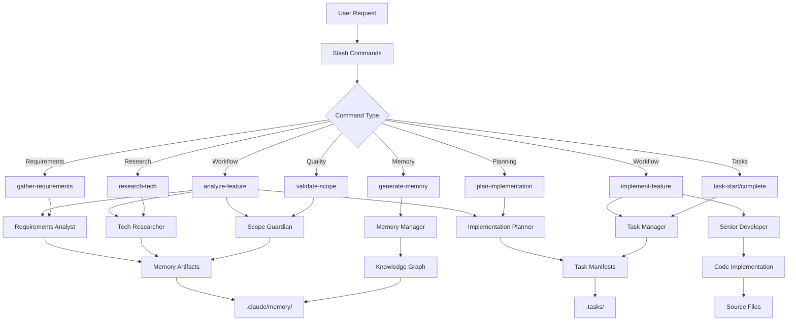
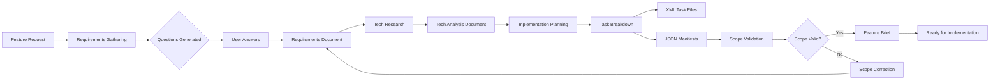
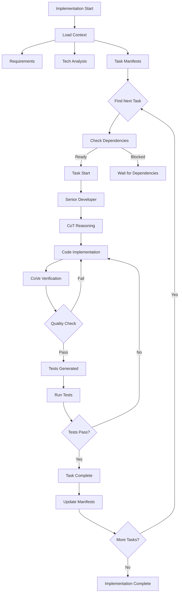
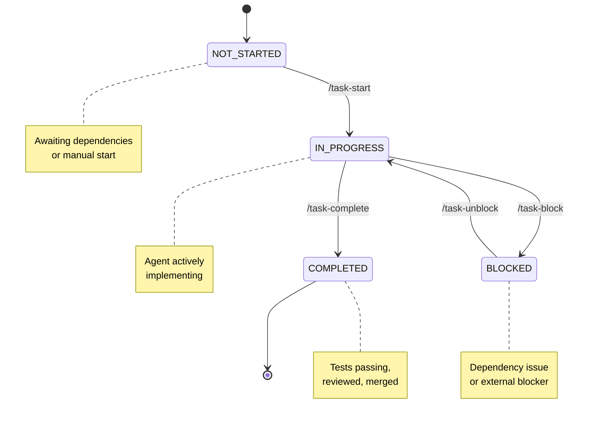
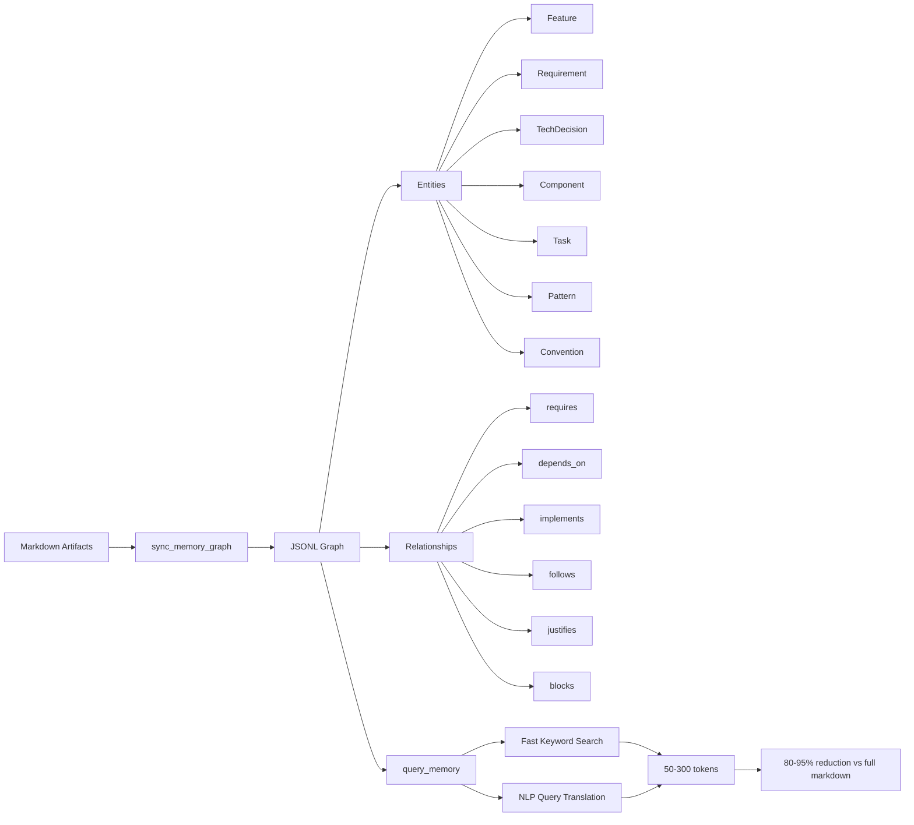

# Claude Code Workflow System

Advanced SDLC orchestration framework for Claude Code using specialized agents, slash commands, and CLI tooling for systematic feature development.

---

## Quick Start

### Prerequisites

- Python 3.12+
- `uv` for virtual environment management
- Claude Code CLI installed
- Git

### Installation

```bash
# 1. Install code-tools CLI
cd tools
uv venv
source .venv/bin/activate  # Linux/macOS: source .venv/bin/activate | Windows: .venv\Scripts\activate
pip install -e .[web]

# 2. Verify installation
code-tools --help
```

### First Workflow

```bash
# Analyze a new feature (full SDLC)
/analyze-feature "User authentication with JWT"

# Check created artifacts
ls .claude/memory/requirements-*.md
ls .tasks/01-*/

# Start implementation
/implement-feature user-authentication
```

### Common Commands

| Command                                   | Purpose                                                       |
| ----------------------------------------- | ------------------------------------------------------------- |
| `/analyze-feature [description]`          | Full SDLC: requirements -> research -> planning -> validation |
| `/gather-requirements [description]`      | Elicit requirements through structured questions              |
| `/research-tech [feature-slug]`           | Technology stack analysis and recommendations                 |
| `/plan-implementation [feature-slug]`     | Generate task manifests from requirements                     |
| `/task-next [feature-slug]`               | Get next available task (dependency-aware)                    |
| `/task-start [task-id] [feature-slug]`    | Begin task implementation                                     |
| `/task-complete [task-id] [feature-slug]` | Mark task complete + sync manifests                           |
| `/review-code [feature-slug]`             | Pre-merge code review                                         |

---

## System Architecture



---

## Feature Analysis Workflow



---

## Feature Implementation Flow



---

## Task Lifecycle



---

## Memory & Knowledge Graph



---

## Project Structure

```
.
+-- .claude/                          # Claude Code configuration
    +-- agents/                       # Specialized agent definitions (12 agents)
    |   +-- requirements-analyst.md
    |   +-- tech-researcher.md
    |   +-- implementation-planner.md
    |   +-- scope-guardian.md
    |   +-- senior-developer.md
    |   +-- qa-engineer.md
    |   +-- code-review-specialist.md
    |   +-- task-manager.md
    |   +-- memory-manager.md
    |   +-- memory-migrator.md
    |   +-- codebase-archeologist.md
    |   +-- ux-ui-designer.md
    |
    +-- commands/                     # Slash command workflows
    |   +-- workflow/
    |   |   +-- analyze-feature.md
    |   |   +-- implement-feature.md
    |   +-- requirements/
    |   |   +-- gather-requirements.md
    |   +-- research/
    |   |   +-- research-tech.md
    |   |   +-- mine-patterns.md
    |   +-- planning/
    |   |   +-- plan-implementation.md
    |   +-- quality/
    |   |   +-- validate-scope.md
    |   |   +-- validate-consistency.md
    |   |   +-- validate-manifests.md
    |   |   +-- review-code.md
    |   +-- tasks/
    |   |   +-- task-start.md
    |   |   +-- task-complete.md
    |   |   +-- task-status.md
    |   |   +-- task-next.md
    |   |   +-- task-block.md
    |   |   +-- task-unblock.md
    |   +-- memory/
    |   |   +-- generate-memory.md
    |   |   +-- update-memory.md
    |   |   +-- cleanup-memory.md
    |   +-- design/
    |   |   +-- design-ui.md
    |   +-- generators/
    |       +-- design.md
    |       +-- prompt.md
    |
    +-- hooks/                        # Validation hooks
    +-- memory/                       # Knowledge artifacts (JSONL graphs)
    +-- schemas/                      # XML/JSON schemas + templates

+-- tools/                            # code-tools CLI package
    +-- code_tools/
        +-- __init__.py
        +-- file_ops.py
        +-- web_ops.py
        +-- task_management.py
        +-- graph.py
        +-- parsers/

+-- .tasks/                           # Feature execution (gitignored)
    +-- manifest.json                 # Root manifest
    +-- {NN}-{feature-slug}/          # Per-feature directories
        +-- manifest.json             # Task manifest
        +-- feature-brief.md
        +-- requirements-{slug}.md
        +-- T01-{task-slug}.xml
        +-- ...
```

---

## Commands Reference

### Workflow Commands

#### `/analyze-feature [description]`

**Purpose**: Complete feature analysis workflow - orchestrates requirements, tech research, planning, and validation

**Phases Executed**:

1. Requirements gathering (requirements-analyst)
2. Technology research (tech-researcher)
3. Implementation planning (implementation-planner)
4. Scope validation (scope-guardian)
5. Synthesis and feature brief generation

**Artifacts Created**:

- `.claude/memory/requirements-{slug}.md`
- `.claude/memory/tech-analysis-{slug}.md`
- `.claude/memory/{slug}.jsonl` (knowledge graph)
- `.tasks/{NN}-{slug}/manifest.json`
- `.tasks/{NN}-{slug}/T01-{task}.xml` (multiple tasks)

**Example**:

```bash
/analyze-feature "Real-time chat with WebSocket support"
```

---

#### `/implement-feature [feature-slug]`

**Purpose**: Orchestrate feature implementation using CoT, CoVe, and anti-hallucination techniques

**Prerequisites**: All planning artifacts must exist (requirements, tech analysis, implementation plan, scope validation)

**Workflow**:

1. Load implementation context
2. Build dependency graph
3. Execute tasks in dependency order
4. Apply quality gates per task
5. Generate implementation summary

**Quality Gates**:

- Code standards compliance
- Test coverage
- Security review
- Scope compliance
- Anti-hallucination checks

**Example**:

```bash
/implement-feature user-authentication
```

---

### Requirements Commands

#### `/gather-requirements [description]`

**Purpose**: Two-pass requirements elicitation - generates questions then processes answers

**Mode 1: Generate Questions**

- Analyzes context
- Generates 5-level structured questions (Purpose, Functional, NFR, Constraints, Acceptance)
- Outputs `.claude/memory/.tmp-questions-{slug}.md`

**Mode 2: Generate Requirements**

- Reads user answers from `.claude/memory/.tmp-answers-{slug}.md`
- Creates requirements document with confidence levels
- Assigns feature ID and creates directory structure

**Output**:

- `.tasks/{NN}-{slug}/feature-brief.md`
- `.tasks/{NN}-{slug}/requirements-{slug}.md`
- Updated `.tasks/manifest.json`

**Example**:

```bash
/gather-requirements "OAuth authentication for API"
```

---

### Research Commands

#### `/research-tech [feature-slug]`

**Purpose**: Technology stack research and recommendation with grounded analysis

**Capabilities**:

- Library/framework evaluation
- Architecture pattern recommendations
- Security/performance trade-off analysis
- Grounded in official documentation (uses WebFetch)

**Output**:

- `.claude/memory/tech-analysis-{slug}.md`

**Example**:

```bash
/research-tech user-authentication
```

---

#### `/mine-patterns [--type pattern-type]`

**Purpose**: Extract and analyze recurring code patterns from codebase

**Pattern Types**:

- Naming conventions
- Structural patterns
- API design patterns
- Configuration patterns

**Output**: Pattern documentation with conformance metrics

**Example**:

```bash
/mine-patterns --type naming
```

---

### Planning Commands

#### `/plan-implementation [feature-slug]`

**Purpose**: Generate task manifests (XML + JSON) from requirements

**Prerequisites**:

- Requirements document
- Tech analysis document

**Outputs**:

- Task breakdown into phases
- XML task files (`.tasks/{NN}-{slug}/T{NN}-{task}.xml`)
- Task manifest (`.tasks/{NN}-{slug}/manifest.json`)
- Dependency graph

**Example**:

```bash
/plan-implementation user-authentication
```

---

### Quality Commands

#### `/validate-scope [feature-slug]`

**Purpose**: Scope creep detection and feature drift prevention

**Checks**:

- Planned features vs implemented features
- Requirements coverage
- Deferred features validation

**Output**: Scope validation report with flagged issues

**Example**:

```bash
/validate-scope user-authentication
```

---

#### `/validate-consistency [feature-slug]`

**Purpose**: Validate new feature plan against existing codebase conventions

**Checks**:

- Naming convention alignment
- Architectural pattern consistency
- Technology stack compatibility
- Code structure conformance

**Example**:

```bash
/validate-consistency user-authentication
```

---

#### `/validate-manifests`

**Purpose**: Validate task and root manifest consistency

**Checks**:

- Task counts match between manifests
- Status synchronization
- Dependency validity
- Blocker consistency

**Example**:

```bash
/validate-manifests
```

---

#### `/review-code [feature-slug]`

**Purpose**: Pre-merge code review using worktree branch analysis

**Review Areas**:

- Code quality and standards
- Security vulnerabilities
- Performance issues
- Test coverage
- Documentation completeness

**Example**:

```bash
/review-code user-authentication
```

---

### Task Commands

#### `/task-start [task-id] [feature-slug]`

**Purpose**: Start task implementation (validates dependencies)

**Validations**:

- Dependency completion check
- Status transition validation (NOT_STARTED -> IN_PROGRESS)
- Manifest consistency

**Example**:

```bash
/task-start T01 user-authentication
```

---

#### `/task-complete [task-id] [feature-slug]`

**Purpose**: Mark task complete and sync manifests

**Actions**:

- Status update (IN_PROGRESS -> COMPLETED)
- Root manifest sync
- Dependency chain update
- Completion timestamp

**Example**:

```bash
/task-complete T01 user-authentication
```

---

#### `/task-status [feature-slug]`

**Purpose**: Check task progress and feature status

**Output**:

- Task counts (total, completed, in progress, blocked)
- Progress percentage
- Blocker list
- Next available tasks

**Example**:

```bash
/task-status user-authentication
```

---

#### `/task-next [feature-slug]`

**Purpose**: Get next available task (dependency-aware)

**Logic**:

- Finds tasks with status NOT_STARTED
- Validates all dependencies are COMPLETED
- Returns highest priority unblocked task

**Example**:

```bash
/task-next user-authentication
```

---

#### `/task-block [task-id] [feature-slug] [reason]`

**Purpose**: Mark task as blocked by an issue

**Actions**:

- Status update (IN_PROGRESS -> BLOCKED)
- Record blocker reason
- Sync manifests

**Example**:

```bash
/task-block T03 user-authentication "Waiting for API key from ops"
```

---

#### `/task-unblock [task-id] [feature-slug]`

**Purpose**: Unblock task and resume work

**Actions**:

- Status update (BLOCKED -> IN_PROGRESS)
- Clear blocker
- Sync manifests

**Example**:

```bash
/task-unblock T03 user-authentication
```

---

### Memory Commands

#### `/generate-memory [--scope path] [--focus aspect] [--depth level]`

**Purpose**: Generate memory artifacts from existing codebase

**Parameters**:

- `--scope`: Specific directory or file path
- `--focus`: Aspect to focus on (architecture, patterns, conventions, dependencies)
- `--depth`: Analysis depth (quick, standard, comprehensive)

**Output**: JSONL knowledge graphs and markdown documentation

**Example**:

```bash
/generate-memory --scope src/auth --focus security --depth comprehensive
```

---

#### `/update-memory [aspect]`

**Purpose**: Incremental memory artifact updates after codebase changes

**Aspects**:

- requirements
- tech-decisions
- conventions
- patterns

**Example**:

```bash
/update-memory conventions
```

---

#### `/cleanup-memory [optional: feature-slug]`

**Purpose**: Remove stale memory artifacts

**Actions**:

- Removes `.tmp-*` files
- Archives outdated graphs
- Cleans legacy memory structure

**Example**:

```bash
/cleanup-memory user-authentication
```

---

### Design Commands

#### `/design-ui [feature-slug]`

**Purpose**: UX research and UI design for feature

**Outputs**:

- User flows
- Wireframes
- Design specifications
- Component breakdown

**Example**:

```bash
/design-ui user-authentication
```

---

### Generator Commands

#### `/generators:design [project idea or path to prd]`

**Purpose**: Transform project plans into designs via multi-agent pipeline

**Pipeline**:

1. Business analysis
2. Design research
3. Variant generation
4. Quality audit
5. Implementation-ready specs

**Example**:

```bash
/generators:design docs/product-requirements.md
```

---

#### `/generators:prompt [vague prompt]`

**Purpose**: Transform vague prompts into advanced prompt-engineered versions

**Techniques Applied**:

- Chain-of-Thought
- Chain-of-Verification
- Step-Back Prompting
- Few-Shot Examples

**Example**:

```bash
/generators:prompt "Analyze the commands and document them"
```

---

## Agents Reference

### requirements-analyst

**Purpose**: Two-pass requirements elicitation - questions generation, then requirements document creation

**Tools**: Read, Bash, Write

**Methodology**:

- 5-Level Questioning Framework (Purpose, Functional, NFR, Constraints, Acceptance)
- Chain-of-Thought reasoning for gap analysis
- Confidence levels per requirement (High/Medium/Low)
- Source grounding ("According to..." pattern)
- Multi-feature detection and separation

**Key Features**:

- Automatic feature ID assignment
- Root manifest creation/update
- Assumption flagging
- Open questions tracking

---

### tech-researcher

**Purpose**: Technology stack research and recommendation with grounded analysis

**Tools**: Read, WebFetch, Grep, Glob, Bash

**Capabilities**:

- Library/framework evaluation using official docs
- Architecture pattern recommendations
- Security/performance trade-off analysis
- Alternative technology comparison
- Stakeholder-specific justifications

**Anti-Hallucination**:

- WebFetch verification of API claims
- Codebase pattern analysis
- Explicit uncertainty expression

---

### implementation-planner

**Purpose**: Create task manifests (XML) and breakdown from requirements

**Tools**: Read, Write, Bash (code-tools)

**Outputs**:

- Phase-based task breakdown
- XML task files with dependencies
- JSON task manifest
- Dependency graph
- Effort estimates

**Validation**:

- Requirements coverage check
- Dependency cycle detection
- Scope alignment verification

---

### scope-guardian

**Purpose**: Validate scope creep and feature drift

**Tools**: Read, Bash (code-tools)

**Checks**:

- MVP feature alignment
- Deferred features validation
- Implementation vs plan comparison
- Scope expansion detection

**Output**: Scope validation report with flagged deviations

---

### senior-developer

**Purpose**: Code implementation with CoT reasoning, CoVe verification, anti-hallucination

**Tools**: Read, Write, Edit, Bash, Grep, Glob

**Philosophy**:

- YAGNI (You Aren't Gonna Need It)
- Boring Technology (proven > cutting-edge)
- Simple > Clever
- Working Software First

**Workflow**:

1. Context retrieval and grounding
2. Chain-of-Thought task decomposition
3. Standards/best practices grounding
4. Implementation with verification
5. Chain-of-Verification (13-point checklist)
6. Automated testing
7. Documentation and commit

**Anti-Patterns Detected**:

- Premature abstraction
- Speculative features
- Config sprawl
- Premature scaling
- Over-engineering

---

### qa-engineer

**Purpose**: Test execution and validation

**Tools**: Read, Write, Bash, Grep, Glob

**Test Types**:

- Unit tests
- Integration tests
- E2E tests
- Edge case tests
- Security tests

**Coverage**: Tracks test coverage, pass rates, failure analysis

---

### code-review-specialist

**Purpose**: Pre-merge code review

**Tools**: Read, Grep, Glob, Bash

**Review Areas**:

- Code quality and standards
- Security vulnerabilities (OWASP Top 10)
- Performance issues
- Test coverage adequacy
- Documentation completeness
- Architectural conformance

---

### task-manager

**Purpose**: Task status updates and manifest synchronization

**Tools**: Read, Write, Bash (code-tools)

**Functions**:

- Status transitions (NOT_STARTED -> IN_PROGRESS -> COMPLETED)
- Manifest updates (task + root)
- Dependency validation
- Blocker tracking

---

### memory-manager

**Purpose**: Context management and artifact synthesis

**Tools**: Read, Write, Grep, Bash

**Capabilities**:

- JSONL knowledge graph creation
- Entity/relationship extraction
- Graph query optimization
- Artifact cleanup
- Cache invalidation (mtime-based)

---

### memory-migrator

**Purpose**: Migrate legacy `.claude/memory/` to new `.tasks/` structure

**Tools**: Read, Write, Bash, Glob, Grep

**Migration**:

- Automatic structure conversion
- Manifest generation
- Backward compatibility preservation

---

### codebase-archeologist

**Purpose**: Multi-phase codebase analysis with interactive validation

**Tools**: Read, Glob, Grep, Bash, Write

**Analysis Phases**:

- Structure mapping
- Pattern extraction
- Dependency analysis
- Convention documentation

---

### ux-ui-designer

**Purpose**: UX research and UI design specialist

**Tools**: Read, Write, WebFetch

**Deliverables**:

- User flows
- Wireframes
- Design specifications
- Component breakdown
- Accessibility compliance (WCAG AA)

---

## code-tools CLI Reference

Portable CLI providing 20+ subcommands for consistent file operations across agents.

### Installation

```bash
cd tools
pip install -e .[web]    # Editable install with web extras
# OR
pip install .[web]       # Standard install
```

### Core Commands

#### File Operations

**list_dir** - List directory contents with depth control

```bash
code-tools list_dir --path . --depth 2

# Output: JSON with directories and files
```

**search_file** - Search files by glob pattern

```bash
code-tools search_file --glob "src/**/*.py" --limit 50

# Returns: Matching file paths
```

**grep_code** - Search code for patterns

```bash
code-tools grep_code --pattern "def authenticate" --paths "src,lib" --limit 30

# Returns: File paths + line numbers + context
```

**read_file** - Read file with line range

```bash
code-tools read_file --path docs/README.md --start 1 --end 100

# Returns: File content with line numbers
```

**create_file** - Create new file

```bash
code-tools create_file --file output.txt --content @content.txt --add-last-line-newline

# Creates: New file with content from content.txt
```

**edit_file** - Edit existing file

```bash
code-tools edit_file --file output.txt --patch @changes.txt

# Applies: Patch to existing file
```

**search_replace** - Search and replace in file

```bash
code-tools search_replace --file config.md --replacements @replacements.json

# Replacements format:
# [
#   {"search": "old-text", "replace": "new-text"},
#   {"search": "pattern", "replace": "value"}
# ]
```

---

#### Web Operations

**fetch_content** - Fetch web content

```bash
code-tools fetch_content --url https://example.com/docs

# Returns: HTML content (converted to markdown)
```

---

#### Task Management (v1.1)

**slugify_feature** - Convert feature name to slug

```bash
code-tools slugify_feature --name "User Authentication" --feature-id 01

# Returns: user-authentication
```

**read_task_manifest** - Read manifest with metrics

```bash
code-tools read_task_manifest --path .tasks/01-auth/manifest.json

# Returns:
# {
#   "task_count": 15,
#   "completed_count": 8,
#   "in_progress_count": 2,
#   "blocked_count": 1,
#   "tasks": [...]
# }
```

**update_task_status** - Update task status and sync manifests

```bash
code-tools update_task_status --task-id T01 --status IN_PROGRESS --feature-dir .tasks/01-auth

# Statuses: NOT_STARTED | IN_PROGRESS | COMPLETED | BLOCKED
# Syncs: Task manifest + root manifest
```

**find_next_task** - Get next available task (dependency-aware)

```bash
code-tools find_next_task --manifest .tasks/01-auth/manifest.json

# Returns: Next task with validated dependencies
```

**validate_manifest** - Check manifest consistency

```bash
code-tools validate_manifest --feature-dir .tasks/01-auth

# Checks:
# - Task counts accuracy
# - Status synchronization
# - Dependency validity
# - Blocker consistency
```

**list_memory_artifacts** - List/filter memory artifacts

```bash
code-tools list_memory_artifacts --dir .claude/memory --feature user-auth

# Categories: requirements, tech_analysis, implementation_plans, scope_validations
```

---

#### Knowledge Graph (v1.2)

**sync_memory_graph** - Build JSONL graphs from markdown

```bash
code-tools sync_memory_graph --dir .claude/memory --feature user-authentication

# Actions:
# 1. Parse markdown artifacts
# 2. Extract entities (Feature, Requirement, TechDecision, Component, Task, Pattern, Convention)
# 3. Extract relationships (requires, depends_on, implements, follows, justifies, blocks)
# 4. Generate JSONL graph
# 5. Cache with mtime tracking (auto-invalidates on changes)
```

**query_memory** - Query knowledge graph with natural language

```bash
code-tools query_memory --dir .claude/memory --feature user-authentication \
  --query "security requirements" --mode direct --limit 10

# Modes:
#   direct - Fast keyword-based graph query (default)
#   nlp - LLM-powered query translation (placeholder)
#   auto - Try direct, fallback to NLP if no results

# Returns: Matching entities + relationships (50-300 tokens vs 1200-3000 for full markdown)
```

---

### Entity Types Supported

1. **Feature** - status, priority, dependencies, tags
2. **Requirement** - functional, non-functional, security, performance
3. **TechDecision** - rationale, alternatives, stakeholders
4. **Component** - code components, dependencies, file paths
5. **Task** - status, blockers, dependencies
6. **Pattern** - naming, structure, conformance metrics
7. **Convention** - rules, deviations, conformance percentage

---

### Relationship Types

- **requires**: Feature -> Requirement
- **depends_on**: Feature -> Feature, Task -> Task, Component -> Component
- **implements**: Component -> Requirement
- **follows**: Component -> Convention/Pattern
- **justifies**: TechDecision -> Component/Feature
- **blocks**: Task -> Task
- **derived_from**: Requirement -> Requirement

---

### Output Format

All commands return JSON:

```json
{
  "ok": true,
  "tool": "read_file",
  "version": "1.2.0",
  "data": { ... }
}
```

or

```json
{
  "ok": false,
  "tool": "read_file",
  "version": "1.2.0",
  "error": "File not found: path.txt"
}
```

---

### Token Savings

- **Task commands**: 30-40% reduction (consolidates 30-50 lines of bash)
- **Graph queries**: 80-95% reduction (50-300 tokens vs 1200-3000 for full markdown)

---

## Complete Workflow Example

### Scenario: Implement User Authentication Feature

```bash
# Step 1: Analyze feature (full SDLC)
/analyze-feature "User authentication with JWT and refresh tokens"

# Artifacts created:
# - .claude/memory/requirements-user-authentication.md
# - .claude/memory/tech-analysis-user-authentication.md
# - .claude/memory/user-authentication.jsonl (knowledge graph)
# - .tasks/01-user-authentication/manifest.json
# - .tasks/01-user-authentication/T01-database-schema.xml
# - .tasks/01-user-authentication/T02-jwt-service.xml
# - .tasks/01-user-authentication/T03-auth-endpoints.xml
# - etc.

# Step 2: Query knowledge graph for quick context
code-tools query_memory --dir .claude/memory --feature user-authentication \
  --query "security requirements" --limit 5

# Returns: 50-300 tokens of relevant entities (vs 1200+ for full markdown)

# Step 3: Get next task to implement
/task-next user-authentication
# Returns: T01 (database-schema) - no dependencies

# Step 4: Start task
/task-start T01 user-authentication
# Status: NOT_STARTED -> IN_PROGRESS

# Step 5: Implementation (by senior-developer agent)
/implement-feature user-authentication
# Agent executes T01 with:
#   - CoT reasoning
#   - Context grounding
#   - Code implementation
#   - CoVe verification (13-point checklist)
#   - Test generation
#   - Documentation

# Step 6: Complete task
/task-complete T01 user-authentication
# Status: IN_PROGRESS -> COMPLETED
# Manifests synced

# Step 7: Check progress
/task-status user-authentication
# Output:
# Feature: user-authentication
# Total: 8 tasks
# Completed: 1 (12.5%)
# In Progress: 0
# Blocked: 0
# Next: T02 (jwt-service) - dependencies met

# Step 8: Continue implementation loop
/task-next user-authentication  # Returns T02
/task-start T02 user-authentication
# ... repeat until all tasks complete

# Step 9: Code review
/review-code user-authentication
# Review areas:
#   - Code quality
#   - Security (OWASP Top 10)
#   - Performance
#   - Test coverage
#   - Documentation

# Step 10: Final validation
/validate-scope user-authentication
# Checks: MVP features, deferred features, scope creep
```

---

## Key Design Principles

1. **Agent Specialization** - Single-responsibility agents for each SDLC phase
2. **Code-Tools Enforcement** - All file operations via `code-tools` CLI (consistency + auditability)
3. **Schema Validation** - XML/JSON schemas for task definitions + manifests
4. **Knowledge Graph** - JSONL-based memory for 80-95% token reduction
5. **Hooks** - Automated validation on task transitions + manifest updates
6. **No Hallucinations** - Agents must use code-tools to inspect codebase (no guessing)
7. **Pragmatic Engineering** - YAGNI, boring technology, simple > clever, working software first

---

## Validation

### Validate XML Tasks

```bash
xmllint --schema .claude/schemas/task-schema.xsd .tasks/01-feature/T01-task.xml
```

### Validate JSON Manifests

```bash
npm install -g ajv-cli
ajv validate -s .claude/schemas/root-manifest-schema.json -d .tasks/manifest.json
ajv validate -s .claude/schemas/task-manifest-schema.json -d .tasks/01-feature/manifest.json
```

### Validate Manifest Consistency

```bash
code-tools validate_manifest --feature-dir .tasks/01-user-authentication
```

---

## Testing

```bash
cd tools
pip install pytest jsonschema
pytest -q
```

---

## Naming Conventions

| Item         | Format                | Example               |
| ------------ | --------------------- | --------------------- |
| Feature ID   | Two-digit zero-padded | `01`, `02`, `99`      |
| Feature Slug | lowercase-hyphen      | `user-authentication` |
| Task ID      | `T` + two-digit       | `T01`, `T15`          |
| Task Slug    | lowercase-hyphen      | `database-schema`     |

---

## References

- **Agent Definitions**: `.claude/agents/*.md`
- **Command Definitions**: `.claude/commands/**/*.md`
- **Schema Documentation**: `.claude/schemas/README.md`
- **code-tools README**: `tools/README.md`
- **Prompt Engineering Techniques**: `.claude/promptengineering/`
